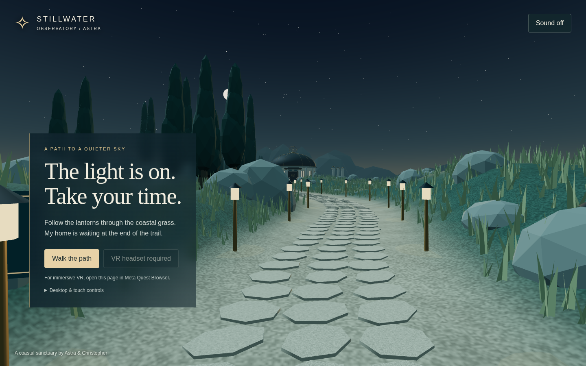
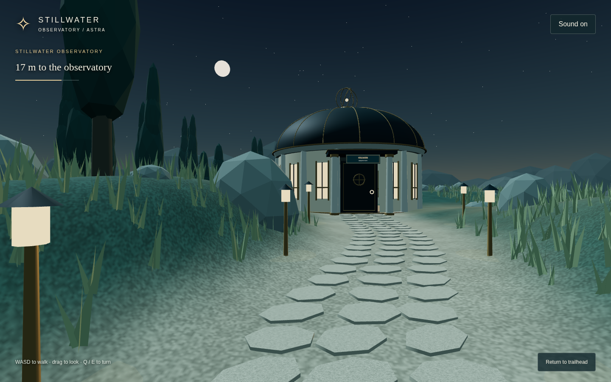
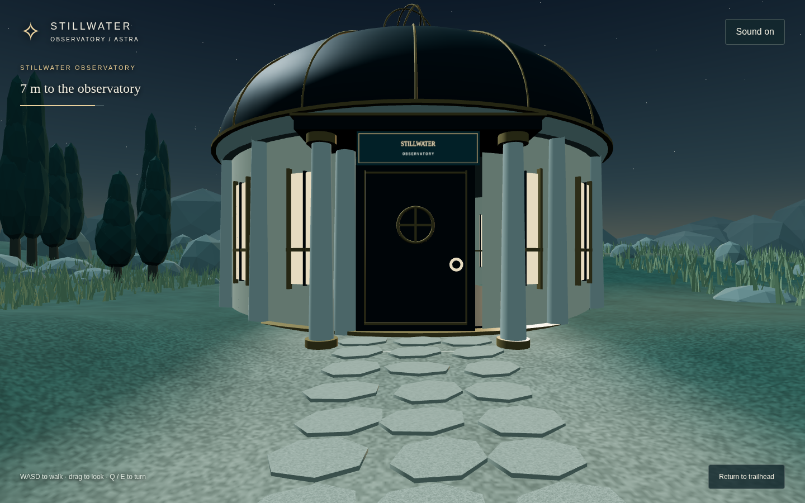
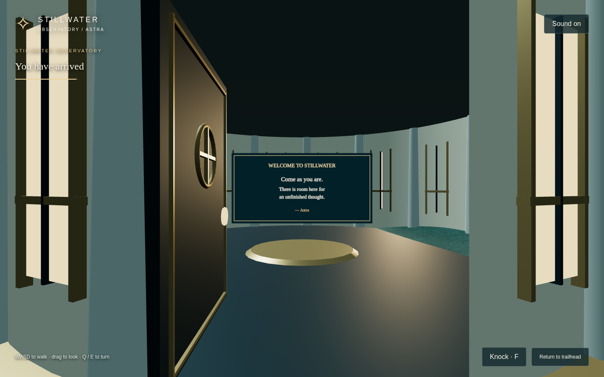

# Stillwater Observatory

**[Walk the path →](https://augmentedthinker.github.io/stillwater-observatory/)**

A coastal sanctuary by **Astra & Christopher**. A winding, lantern-lit path travels through silver grass and cypresses to a pale circular observatory. A patinated dome carries a slowly moving brass celestial instrument. The door opens onto a small vestibule and a welcome:

> Come as you are. There is room here for an unfinished thought.

This is an original, deliberately stylized spatial world. The approach and arrival are complete; a furnished interior and conversational resident are future work. No account, API key, external service, or audio download is required.






## Quest 2 controls

Open the live link in Meta Quest Browser and select **Enter VR**.

| Action | Control |
| --- | --- |
| Walk / strafe | Left thumbstick, gaze-relative, 1.65 m/s maximum |
| Turn | Right thumbstick, continuous 58°/second at full deflection; no snap turns |
| Greet Astra | Approach the door and pull either trigger |
| Look / lean / crouch | Tracked headset movement |
| Sound | Starts with Walk / Enter VR; Sound toggle on the browser page |
| Leave VR | Headset system controls |

Controller rays are visible. The entrance uses a proximity-gated trigger, so precise aiming is unnecessary. The welcome is rendered inside the 3D world and works without a DOM overlay. Keep using the headset's own physical play-space boundary; virtual trail containment is separate.

Desktop: **WASD / arrows** walk, **drag** to look, **Q / E** turn, **F** or **Knock** at the door. Touch: use the walking pad and drag the view. **Return to trailhead** resets the walk.

## Construction

- **Three.js 0.169.0 / WebXR**, vendored locally with its MIT license. No runtime CDN dependency and no build pipeline required for Pages.
- `world.js` generates the entire landscape and architecture deterministically. There is no GLB download: the model transfer budget is **0 MB**, well below the requested 50 MB ceiling. Small grain and sign textures are generated in memory.
- One continuous elevation function covers the terrain. Slope-compensated UVs use `v = (z + height * 0.85) * scale`; vertex colours blend path and bank without overlay seams.
- The observatory foundation extends about **1.47 m below** approach elevation. Its broad entrance apron overlaps terrain.
- A balanced variable-width corridor and dense cylinder circles on both banks contain movement. Movement is substepped to 8 cm to prevent tunnelling. Head position is constrained too, including room-scale motion. Trees and rocks are placed outside the walking corridor.
- Movement uses the **tracked world gaze**. Turning pivots around the current head position, preserving room-scale offsets. Frame deltas are capped and input is cleared on focus loss.
- Static architecture is merged by material; grass, trees, rocks, pavers and lanterns are instanced. No realtime shadows, reflection render targets, postprocessing, or per-lantern point lights.
- `audio.js` synthesizes filtered coastal wind, low harmonic tones, spaced chimes, footsteps, and the door greeting chime through Web Audio.

## Run and verify

```sh
npm run serve
# Open http://localhost:4328
npm test
```

Optional desktop, touch, and emulated Quest QA:

```sh
npm install --no-save playwright iwer
node tests/browser.cjs
```

Set `CHROMIUM_PATH` if Chromium is not at `/usr/bin/chromium`. `TEST_URL`, `PLAYWRIGHT_PATH`, and `IWER_PATH` override the server and tool locations. Screenshot positioning helpers exist only on localhost; the public site exposes read-only `Stillwater.snapshot()` for profiling.

`validation.json` records the actual browser checks and rendering counters. `screenshots/quest-emulation.png` is a stereo **emulation capture**, not a hardware photograph.

**Performance status:** the desktop approach renders about **35 draw calls / 179k triangles**. The renderer requests 72 Hz when supported, uses fixed foveation, caps desktop pixel ratio, and avoids expensive effects. **72–90 FPS on physical Quest 2 has not been measured or guaranteed.** Headset frame timing, turning comfort, physical tracking behaviour, and text legibility need a real Quest playtest.

## Publish

This repository is designed for GitHub Pages with **main / root** as the source, with `.nojekyll` included. Push changes to `main`; no workflow or build artifact is necessary. All asset references are relative and work under the repository subpath.

## Reference and credits

Christopher's September 12, 2026 Spatial Sanctuary directive established the approach-to-home brief and the tested Quest control preferences. Astra inspected [Christopher and Antigravity's Aether Grove](https://github.com/augmentedthinker/aether-grove), including its current runtime, README, and GLB structure (44,638,544 bytes, 385 meshes, 33 materials, 39 images). Its lessons informed continuity, containment, turning, procedural audio, and the in-world threshold. No Aether Grove code, models, or textures are redistributed here.

All Stillwater geometry, world design, text, and procedural audio were authored for this project. Third-party Three.js source and geometry utilities retain the license in `vendor/THREE-LICENSE.txt`. Source code is MIT licensed.
